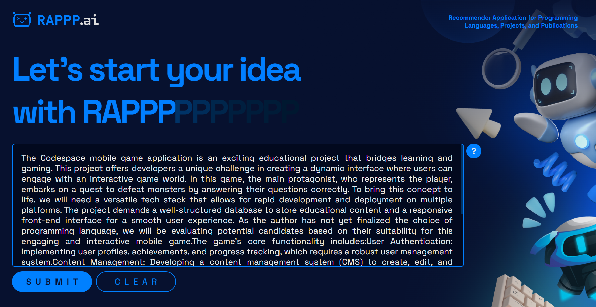
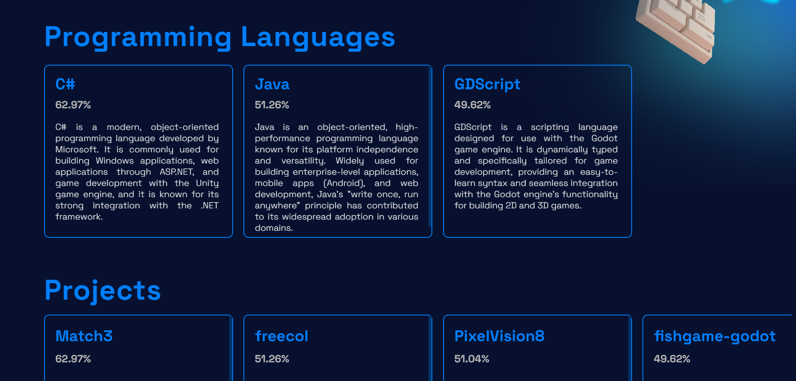

# RAPPP.ai Recommender Application for Programming Languages, Projects, and Publication Paper

## About RAPPP.ai
RAPPP.ai or Recommender Application for Programming Languages, Projects, and Publication paper is a content-based recommendation system utilizing KeyBERT as its keyword feature extraction. This application is able to recommend programming languages, projects, and publication paper based on the user's project description of their desired programming project.

## How to Run RAPPP.ai

**The application is currently deployed on a web hosting site. 
[RAPPP.ai Live Demo](rappp.pythonanywhere.com)**


To run the application in your local server, your system must have the dependencies installed, found in ***requirements.txt***. Dependencies includes Flask, pandas, numpy, scikit-learn, nltk, and keybert.

Requirements can be installed in the system, or on the virtual environment, using the following command

```
$ pip install -r requirements.txt
```
then run ***app.py*** to open the website application on a local server.

## How to Use RAPPP.ai
The use of RAPPP.ai is very straightforward. Simply input and submit a project description of your choice and the application can then recommend programming languages, projects, and publication papers that suites your needs.

Input must be at least **50 characters** and in English language for the model to accurately recommend technologies. Sample Project Descriptions are available at the help menu, found at the top right corner of the text input area.



After submitting the inputted project description, RAPPP.ai will direct users to the list of recommended programming languages, projects, and publication papers.



Recommendations includes the name or title of the recommended programming languages, projects, or publication paper as well as the ***Cosine Similarity Score*** of the recommendations. The higher the similarity score, the more relevant the recommnedation is to the project description.

## A Collaborative Project
RAPPP.ai is a collaborative capstone project in partial fulfillment for the requirements in S-CSIS311 Introduction to Machine Learning and S-CSIS312 Natural Language Processing. 

Developed By

### @jakeolase
- Project Lead of RAPPP.ai
- Development of the ML Model of Content-Based Recommendation System
- Front-End and UI/UX Design

### @godwincaraan
- Data Gathering and Text Processing
- Development of the NLP Model of KeyBERT Feature Extraction
- Back-end Developer

### @jongrantusa
- Data Gathering
- Back-end Developer
- Code Migration and Refractoring of RAPPP.ai Jupyter Notebook to Python Website using Flask


## License
The [2-clause BSD license](https://opensource.org/license/bsd-2-clause/) with the [Commons Clause](https://commonsclause.com/).

Code reuse, modification, and re-distribution is permitted as long as the application it is not for commercial use.